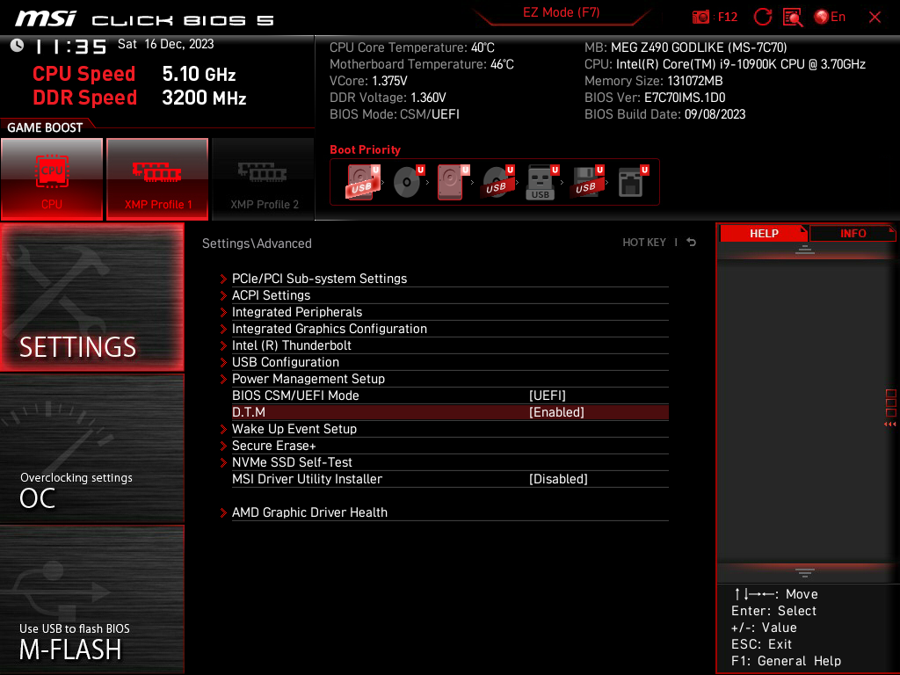
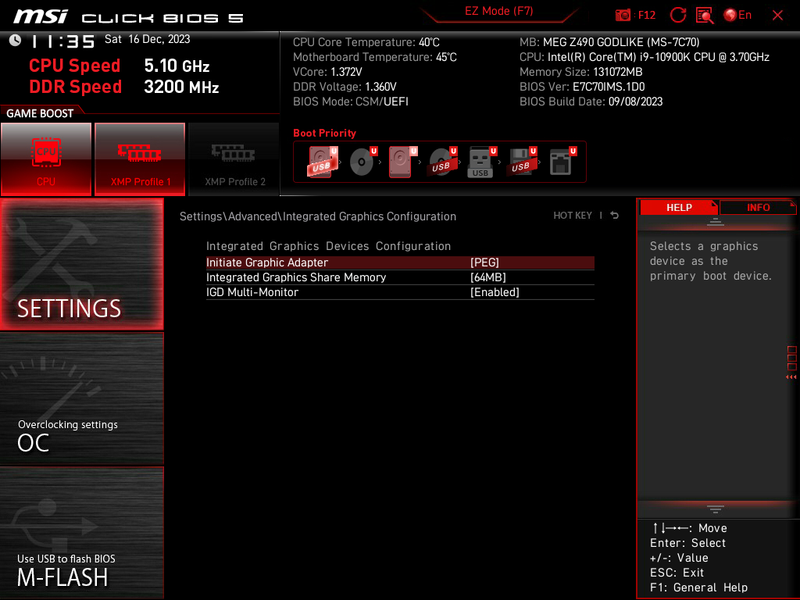
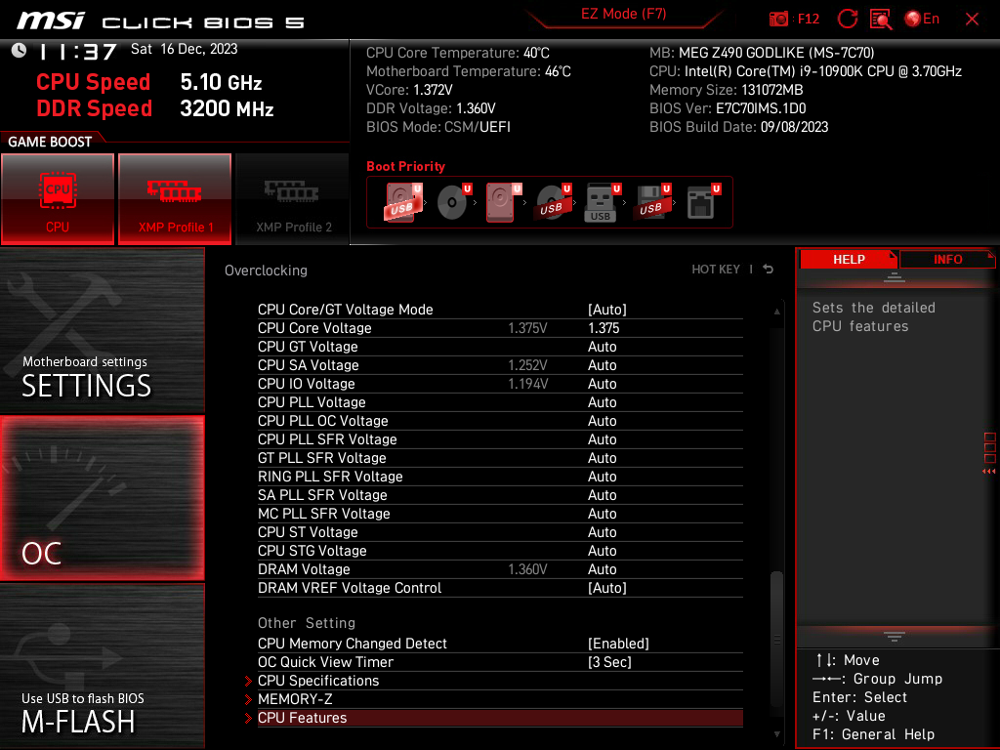
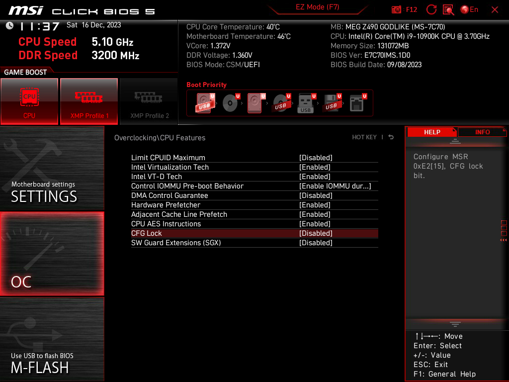
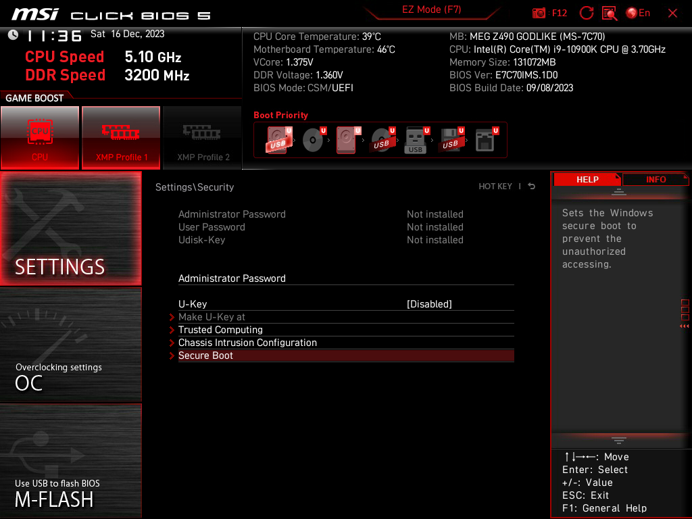
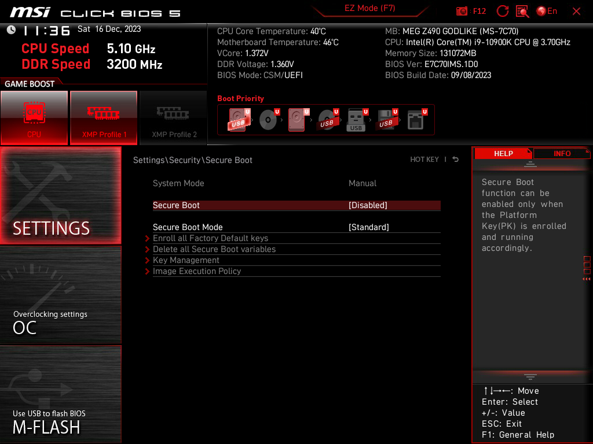
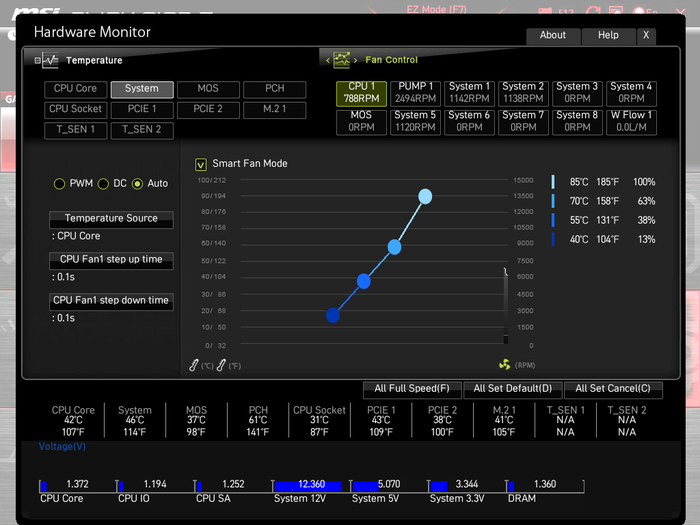

# MEG-Z490-GODLIKE-i910900K-RX6900XT-Hackintosh

---

### Information 

- macOS: [Sonoma](https://www.apple.com/macos/sonoma/)
- bootloader: [OpenCore](https://github.com/acidanthera/OpenCorePkg/releases/latest)

---

### Hardware

| Component    | Variant                   | Link                                                                                                                                         |
|:------------:|:-------------------------:|:--------------------------------------------------------------------------------------------------------------------------------------------:|
| Mainboard    | MEG Z490 GODLIKE          | [www.msi.com](https://www.msi.com/Motherboard/MEG-Z490-GODLIKE/Overview)                                                                     |
| Processor    | Intel Core i9 10900K      | [ark.intel.com](https://ark.intel.com/content/www/us/en/ark/products/199332/intel-core-i910900k-processor-20m-cache-up-to-5-30-ghz.html)     |
| DDR4 RAM     | Corsair 128GB             | [www.corsair.com](https://www.corsair.com/ja/zh/%E7%B1%BB%E5%88%AB/%E4%BA%A7%E5%93%81/%E5%86%85%E5%AD%98/VENGEANCE-LPX/p/CMK128GX4M4A2666C16)|
| NVMe SSD     | Aigo P3500 2TB            | [www.aigo.com](http://www.aigo.com/memory/udisk1/)                                                                                           |
| Graphics     | AMD Radeon RX 6900xt      | [www.amd.com](https://www.amd.com/en/products/graphics/amd-radeon-rx-6900-xt)                                                                |
| Audio        | Realtek ALC1220           | [Supported-codecs](https://github.com/acidanthera/AppleALC/wiki/Supported-codecs)                                                            |
| WiFi / BT    | Intel AX201/BCM94360CD    | [www.intel.com](https://www.intel.com/content/www/us/en/products/sku/130293/intel-wifi-6-ax201-gig/specifications.html)                      |
| Lan          | Aquantia® AQC107 10G      | [Aquantia]()                                                                                                                                 |    
| Lan          | Realtek® RTL8125B 2.5G    | [Realtek]()                                                                                                                                  |
| PC Case      | phanteks PH-ES518XTG      | [phanteks.cn](https://phanteks.cn/Evolv_Series/PH-ES518XTG)                                                                                  |

[Specification](https://www.msi.cn/Motherboard/MEG-Z490-GODLIKE/Specification)

---

### BIOS 

#### firmware 

[Version 7C70v1E](https://www.msi.cn/Motherboard/MEG-Z490-GODLIKE/support)

#### settings

- Enable D.T.M and Select UEFI Mode

- Graphic 

- Close CFG Lock
- Enable Intel Virtualization Tech
- Enable Intel VT-D Tech
- Disable SGX

- Secure boot

- Fan

#### Kexts

|             Kext             |   Version    |                            Author                            |
| :--------------------------: | :----------: | :----------------------------------------------------------: |
|    XHCI-unsupported.kext     |    v0.9.2    | [RehabMan/OS-X-USB-Inject-All](https://github.com/RehabMan/OS-X-USB-Inject-All/tree/master/XHCI-unsupported.kext) |
|          Lilu.kext           |    v1.7.0    | [acidanthera/Lilu](https://github.com/acidanthera/Lilu/releases) |
|      SMCProcessor.kext       |    v1.3.6    | [acidanthera/VirtualSMC](https://github.com/acidanthera/VirtualSMC/releases) |
|       SMCSuperIO.kext        |    v1.3.6    | [acidanthera/VirtualSMC](https://github.com/acidanthera/VirtualSMC/releases) |
|       VirtualSMC.kext        |    v1.3.6    | [acidanthera/VirtualSMC](https://github.com/acidanthera/VirtualSMC/releases) |
|      RadeonSensor.kext       |    v2.3.1    | [ChefKissInc/RadeonSensor](https://github.com/ChefKissInc/RadeonSensor/releases) |
|     RestrictEvents.kext      |    v1.1.5    | [acidanthera/RestrictEvents](https://github.com/acidanthera/RestrictEvents) |
|         NVMeFix.kext         |    v1.1.2    | [acidanthera/NVMeFix](https://github.com/acidanthera/NVMeFix) |
|     AppleALC.kext            |    v1.9.4    | [acidanthera/AppleALC](https://github.com/acidanthera/AppleALC/releases)          |
|     CpuTscSync.kext          |    v1.1.1    | [acidanthera/CpuTscSync](https://github.com/acidanthera/CpuTscSync/releases)      |
| HibernationFixup.kext        |    v1.5.3    | [acidanthera/HibernationFixup](https://github.com/acidanthera/HibernationFixup/releases)    |
|       AirpotItlwm.kext       |    v2.3.0    | [OpenIntelWireless/itlwm](https://github.com/OpenIntelWireless/itlwm/releases) |
| IntelBluetootchFirmware.kext |    v2.4.0    | [OpenIntelWireless/IntelBluetoothFirmware](https://github.com/OpenIntelWireless/IntelBluetoothFirmware/releases) |
|     IntelBTPatcher.kext      |    v2.4.0    | [OpenIntelWireless/IntelBTPatcher.kext](https://github.com/OpenIntelWireless/IntelBluetoothFirmware/releases) |
|      BlueToolFixup.kext      |    v2.7.0    | [acidanthera/BrcmPatchRAM](https://github.com/acidanthera/BrcmPatchRAM/releases) |
|      FeatureUnlock.kext      |    v1.1.7    | [acidanthera/FeatureUnlock](https://github.com/acidanthera/FeatureUnlock/releases) |
|       USBToolBox.kext        |    v1.1.1    | [USBToolBox/kext](https://github.com/USBToolBox/kext/releases) |
|         UTBMap.kext          |    v1.1.1    | [USBToolBox/tool](https://github.com/USBToolBox/tool)     |
|      WhateverGreen.kext      |    v1.6.9    | [acidanthera/WhateverGreen](https://github.com/acidanthera/WhateverGreen/releases) |
|    AirportBrcmFixup.kext     |    v2.1.9    | [acidanthera/AirportBrcmFixup](https://github.com/acidanthera/AirportBrcmFixup/releases) |
|LucyRTL8125Ethernet.kext| v1.2.2 | [Mieze/LucyRTL8125Ethernet](https://github.com/Mieze/LucyRTL8125Ethernet/releases) |

App:

|     App      | Version | Author                                                       |
| :----------: | :-----: | ------------------------------------------------------------ |
|   HeliPort   | v2.0.0-alpha | [OpenIntelWireless/HeliPort](https://github.com/OpenIntelWireless/HeliPort/releases) |

---

### Utils

|          Name           | Version  |                            Author                            |
| :---------------------: | :------: | :----------------------------------------------------------: |
|          ioreg          |  v3.0.2  | [khronokernel/IORegistryClone](https://github.com/khronokernel/IORegistryClone/blob/master/ioreg-302.zip) |
|       Hackintool        |  v4.0.3  | [benbaker76/Hackintool](https://github.com/benbaker76/Hackintool/releases) |
|  OpenCore Configurator  | v2.76.10 | [occ](https://mackie100projects.altervista.org/download-opencore-configurator/) |
|     MonitorControl      |  v4.3.3  | [MonitorControl](https://github.com/MonitorControl/MonitorControl/releases) |
| OpenCore-Legacy-Patcher |  v2.4.0  | [OpenCore-Legacy-Patcher](https://github.com/dortania/OpenCore-Legacy-Patcher) |

---

### Update macOS

Check the official update-guide: [OpenCore-Post-Install/update](https://dortania.github.io/OpenCore-Post-Install/universal/update.html)

1. Backup
   - Full system backup with `Time Machine` or similar software
   - Copy current EFI to OpenCore USB-Drive for recovery purpose
2. Download
   - Latest version of OpenCore and replace files in EFI
   - Updates for all installed kexts and replace in EFI
3. Reboot
   - Boot with updated OpenCore version and kexts
   - If the system doesn't boot, use OpenCore USB-Drive to roll back
4. Update
   - Start macOS Update from `System Settings` -> `Software Update`
   - With OpenCore the update process should work automatically
   - If `Software Update` shows `Mac version is up to date`, download macOS Installer from AppStore and start the update manually

If the system doesn't boot, try to fix the problem or revert to the latest EFI or system-backup.
